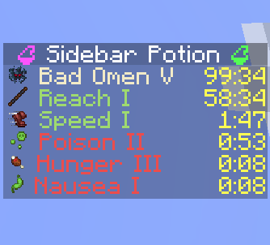
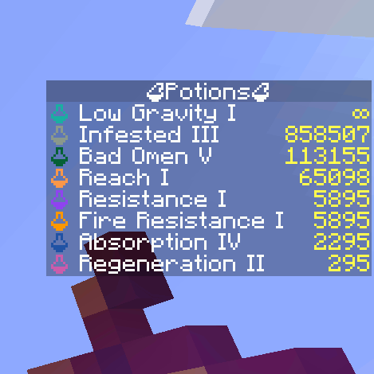

  

  
  
  

# Sidebar Potion

Lightweight server‑side mod that displays players' active status effects in a clean sidebar. The sidebar auto‑updates and hides itself when you have no effects.

- Server‑only: install on a dedicated server or single‑player integrated server. Clients do not need the mod.
- Configurable: names, colors, potency, icons, and duration format.
- Optional [Polymer](https://modrinth.com/mod/polymer) support: show effect icons using resourcepack.
- Supports vanilla and modded effects (e.g. from Enderscapes - works with polymer port)

<video>
  <source src=".media/demo.mp4" type="video/mp4">
</video>

## Installation

- Put the mod on the server (or your single‑player instance). Clients can stay vanilla.
- Optional: install [Polymer](https://modrinth.com/mod/polymer) on the server to enable effect icons for vanilla clients (see below).

## Optional dependency: Polymer

If Polymer is installed on the server:
- Effect icons can be shown to vanilla clients without a client resource pack.
- Set `showIcon` to `true` in the config to display icons.
- Set `forceCompatIcons` to `false` to use Polymer icons instead of potion icons.

Without Polymer:
- Effect icons will be replaced with colored potion icons.

## Configuration

    
    
Examples of different configurations

A JSON file is created on first run at:
- `./config/sidebar-potion.json`

Edit the file and run `/reload` to apply changes.

Available options (with defaults):
- `showEffectName` (boolean, default: `true`): show the effect name.
- `colorizeText` (boolean, default: `true`): colorize lines by effect type.
- `hideDefaultGui` (boolean, default: `true`): hide the vanilla potion effect HUD.
- `showPotency` (boolean, default: `true`): show effect amplifier (e.g. *II*, *III*).
- `showIcon` (boolean, default: `true`): show effect icon.
- `durationFormat` (string, default: `"mm:ss"`): how effect durations are rendered (see below).
- `title` (string, default: `""`): sidebar title text.
- `forceCompatIcons` (boolean, default: `false`): force potion icons even if Polymer is installed.

### Duration formats

Use one of the following values:
- `""` — no duration
- `"t"` — ticks
- `"s"` — seconds
- `"s."` — seconds.milliseconds
- `"mm:ss"` — minutes:seconds
- `"mm:ss."` — minutes:seconds.milliseconds

### Behavior:
- The sidebar is removed for a player when they have no active effects.
- The title is taken from `title` and can be empty.